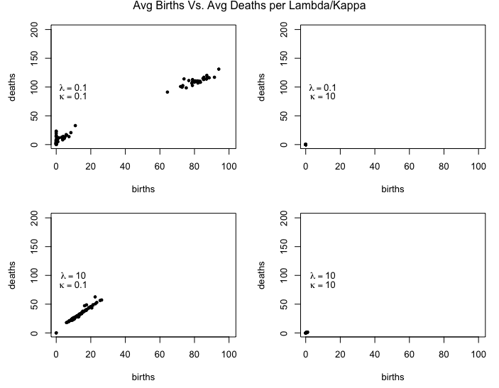

### Table of Contents: {#TOC}
<li>[Introduction](#secIntroduction)</li>
<li>[Background](#secBackground)</li>
<li>[Methods](#secMethods)</li>
<li>[Results](#secResults)</li>
<li>[Conclusions](#secConclusions)</li>
<li>[References](#secReferences)</li>
<li>[Appendix](#secAppendix)</li>
  
***

<a id='secIntroduction'>

### <b>Introduction</b></a>

This report augments the case study performed in chapter 7 of *Data Science in R* "Simulation Study of a Branching Process" [[1]](#REF01).  At the end of section 7.9.1 of the book, the author implies that an alternate parameterization of the functions using just the ratio of the two parameters (kappa and lambda) may be possible if the relationship between the parameters was better understood.  We decided to do some exploratory study into that relationship.

We look at the effects on the number of births, deaths, generations, and jobs by varying the rate for job lifetime (kappa) and the job creation rate (lambda).  We felt the focus on just the upper quartile of the number of offspring, and the static charts attempted in the book do not adequately convey the dynamics of the system, and we attempt to show this with full box/violin plots animated as the parameters change.

[&uarr;TOC](#TOC)

***

<a id='secBackground'>

### <b>Background</b></a>

Throughout the case study [[1]](#REF01), the author consistently used a value of kappa = 0.3 and lambda = 0.5, occasionally setting one of the parameters to 1 to perform a test on a modified function.  The author then makes the suggestion, in section 7.9.1, that the behavior of the system changes when kappa > lambda (the process dies out fairly quickly), and other regions where processes seem to continue indefinitely.  The author then states that the existing code can be used without modification by simply setting kappa to 1.

If the system is truly as dynamic as the plots/discussion indicates, then simply setting one of the parameters to 1 would only yield insight into a very small region of behaviors.  We felt that it would be interesting to vary both parameters and examine the nature of the system.  Obviously, static plots are simply insufficient for displaying the behaviors, so we wanted to capitalize on animated displays to show the dynamic characteristics.

If some combinations of parameter values cause the system to continue indefinitely, we need to halt the process at a reasonable limit in order to collect sufficient data at a variety of combinations in the time available. Arguably, this has the effect of artificially bounding the system response; however, we feel that stopping the process and identifying those conditions are sufficient to show that the process *could* be indefinite under those conditions.

[&uarr;TOC](#TOC)

***

<a id='secMethods'>

### <b>Methods</b></a>

We mimicked the code presented in the case study to ensure we could reproduce the documented results, and then modified the code to collect the data we needed. We conducted an exploratory analysis with the following four lambda/kappa combinations:

|lambda|kappa|
|:----:|:---:|
|0.1|0.1|
|0.1|10|
|10|0.1|
|10|10|

For each lambda/kappa parameter combination, one hundred instances were generated unless the maximum generations or jobs of 200 or 100,000 respectively was reached. For each simulation, the number of generations, the number of jobs, the average birth time, and the average death time were recorded. The aggregate list of the simulation results were then visualized for easier insight.

The results of the exploratory simulation informed our decision to focus on smaller values of lambda and kappa and reduce the cutoff of generations and jobs to 20 and 1,000 respectively. The final analysis conducted four hundred simulations for each below parameter combinations. As before, the results were visualized for easier insight.

<b>$\lambda$</b> : 0.1, 0.2, 0.3, 0.4, 0.5, 0.6, 0.8, 1.0, 1.2, 1.4, 1.6, 1.8, 2.0, 2.25, 2.5, 2.75, 3.0

<b>$\kappa$</b> : 0.1, 0.2, 0.3, 0.4, 0.5, 0.6, 0.8, 1.0, 1.2, 1.4, 1.6, 1.8, 2.0, 2.25, 2.5, 2.75, 3.0, 3.25, 3.5, 3.75, 4.0, 4.5, 5.0

[&uarr;TOC](#TOC)

***

<a id='secResults'>

### <b>Results</b></a>

The results of our exploratory simulation for average birth and average death time per the four lambda/kappa combinations. When kappa is ten, birth and death times are prematurely cutoff. Kappa rate at 0.1 yields linear results. Lambda and Kappa rate of 0.1 yields cluster results.

For our final simulation, we iterated through all combinations of kappa and lambda and examined the results in a variety of ways to understand the behaviors, see Figure 2.

From visual inspection:

* There appears to be a "ridge" for the number of generations, with falloff on either side.
    + This would imply an "optimal" fit is possible.
* The chart of total number of jobs mimics the chart displayed in the book in which the author plotted the conditions with at least 20 jobs[[1: figure 7.9, page 306]](#REF01).
* The plots of average birth and average death times show a concave pattern.
    + This artifact may preclude the use of a single ratio if birth and death rates are the desired response variable.
    + Also, these plots show that births and deaths are longer if the lamda/kappa ratio are smaller.

[&uarr;TOC](#TOC)

***

<a id='secConclusions'>

### <b>Conclusions</b></a>

We explored further the relationship of lamda and kappa parameters performed in a use case within chapter 7 of *Data Science in R* "Simulation Study of a Branching Process" [[1]](#REF01).  We looked at the effects on the number of births, deaths, generations, and jobs by varying the rate for job lifetime (kappa) and the job creation rate (lambda).  We chose a heatmap to visualize the final simulation results from all four simulation statistics to compare with previous work in the book and gain possible new insights.

The results of our work shows that a ratio of 0.5 lambda/kappa could be used to define a ridge of generations. A number less than 0.5 yields a lower number of generations. And, a number higher than 0.5 yields a higher number of generations. For the number of jobs statistic, a ratio of 30 yielded the most number of jobs while a ratio of 0.02 yielded the least. Average births and average deaths statistics appear similar with a concave heatmap pattern. The longest average births and deaths occurred when the rates for both lambda and kappa are below 0.3. This new insight requires further investigation to better understand their effects on birth and death timelines.

[&uarr;TOC](#TOC)

***

<a id='secReferences'>

### <b>References</b></a>

*  [1] Nolan, Deborah; Data Science in R; 2015; Simulation Study of a Branching Process; Chapter 7.

[&uarr;TOC](#TOC)

***

<a id='secAppendix'>

### <b>Appendix</b></a>

* R code: <a href='MSDS7333-Case12.R'>MSDS7333-Case12.R</a>
* Support functions: <a href='MSDS7333-Case12-fx.R'>MSDS7333-Case12-fx.R</a>
* Javascript heatmap generation: <a href='ReadGrid.hta'>ReadGrid.hta</a> (note: this is an HTML application that can be executed only on a Microsoft Windows machine)

[&uarr;TOC](#TOC)

***
